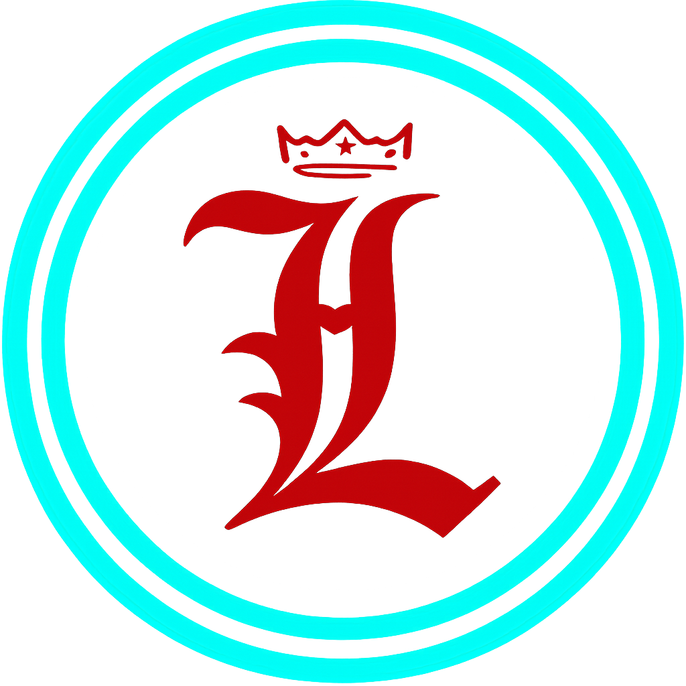

<div align="center">

<a href="https://github.com/leonardoPBF">
  
</a>

<br>

  [](https://github.com/leonardoPBF)
  [](https://github.com/leonardoPBF)
  

</div>
<div align="center">

# Show me time 👻

</div>
<div align="center">

[](https://git.io/typing-svg)
</div>

<p>If u are here, if because im doing great things, thats good, u are seeing now my low level ...</p>

- Right now, I’m building different apps, ranging from easy websites to complex systems like software for businesses. Now I'm interested in software architecture; I think now and in the coming future, it's key
- My best stack and most i used:

<p align="center">
  <a href="">
    
  </a>
</p>


- I’m currently learning ...

  - Cloud Computing
  - Differents types of architecture (microservices, client-server, event-oriented and serverless)
  - Implementation off rabbitmq


<div align="center">


</div>

- Pronouns: leo
- Fun fact: the girls are my weakness HAHa
- Know about my experiences <a href="https://github.com/100rabhcsmc/Me.io/blob/master/01SaurabhChavanReactNativeResume.pdf" target="blank">CV</a>

<div align="center">

<div align="center">


## 📁My best Projects (now)
<table>
  <tr>
    <!-- Proyecto 1 -->
    <td align="center" width="33%">
      <h3>Goodlunch</h3>
      <br><br>
      <a href="https://github.com/leonardoPBF/proyecto1">
        
      </a>
      <a href="https://youtube.com">
        
      </a>
    </td>
    <!-- Proyecto 2 -->
    <td align="center" width="33%">
      <h3>Lumina</h3>
      <br><br>
      <a href="https://github.com/leonardoPBF/proyecto2">
        
      </a>
      <a href="https://youtube.com">
        
      </a>
    </td>
    <!-- Proyecto 3 -->
    <td align="center" width="33%">
      <h3>Coming son..</h3>
      <br><br>
      <a href="https://github.com/leonardoPBF/proyecto3">
        
      </a>
      <a href="https://youtube.com">
        
      </a>
    </td>
  </tr>
</table>
</div>


## My GitHub Stats:  
  <!--- stats (start) -->
<div>

[](https://git.io/streak-stats)


<table>
  <tr>
    <td align="center" width="50%">
      <a href="https://github.com/leonardoPBF">
        
      </a>
    </td>
    <td align="center" width="50%">
      
    </td>
  </tr>
</table>

<!--- stats (end) -->


### Snake of my contributions
<!--- Put your own svg contribution fron: --->
<picture>
  <source media="(prefers-color-scheme: dark)" src="./github-user-contribution-dark.svg" />
  <source media="(prefers-color-scheme: light)" src="./github-user-contribution.svg" />
  
</picture>

</p>
<!--- stats (end) -->

### Gojo

<div align="center">

  

  <details>
    <summary>Don't open please :v</summary>

  <br>

  [](https://git.io/typing-svg)

  <div align="left">

```js
/**
 * Represents me.
 *
 * @constructor
 * @param {string} location - Peru
 * @param {string} languagues - English, spanish
 * @param {string} jobTitle - Engineer of systems.
 * @param {string} specialization - Building full stack apps
 * @param {string} interests - AI, Distributed Systems & Programing
 * @param {string} hobbies - Trekking, basketball, football, voley, run, gaming & playing music.
 * @param {string} stength - Resolute.
 * @param {string} weakness - control of my time and A, G y D top secret.
 *
 * @throws {Punch} To the people who don't want to be better, the team problems and all bugs.
 *
 * @returns {Object} Leo.
 */
  ⣿⣿⣿⣿⣿⣿⣿⣿⣿⣿⣿⣿⠿⠛⠉⠀⠀⠀⠀⠀⠀⠀⠀⠀⠀⠀⠀⠀⠀⠀⠀⠀⠀⠀⠀⠀⠉⠛⠿⣿⣿⣿⣿⣿⣿⣿⣿⣿⣿⣿⣿
⣿⣿⣿⣿⣿⣿⣿⣿⣿⣿⠟⠁⠀⠀⠀⠀⠀⠀⠀⠀⠀⠀⠀⠀⠀⠀⠀⠀⠀⠀⠀⠀⠀⠀⠀⠀⠀⠀⠀⠈⠻⣿⣿⣿⣿⣿⣿⣿⣿⣿⣿⣿⣿
⣿⣿⣿⣿⣿⣿⣿⣿⠟⠀⠀⠀⠀⠀⠀⠀⠀⠀⠀⠀⠀⠀⠀⠀⢀⠀⠀⠀⠀⠀⠀⠀⠀⠀⠀⠀⠀⠀⠀⠀⠀⠈⢿⣿⣿⣿⣿⣿⣿⣿⣿⣿⣿
⣿⣿⣿⣿⣿⣿⡿⠁⠀⠄⠡⠈⠐⠀⠀⠀⠀⠀⠀⠀⠀⠀⢀⡔⣾⣇⡀⠀⠀⠀⠀⠀⠀⠀⠀⠀⠀⠂⠁⠈⠄⠡⠀⢿⣿⣿⣿⣿⣿⣿⣿⣿
⣿⣿⣿⣿⣿⡟⠁⠀⠈⠀⠀⠀⠀⠀⠀⠀⠀⠀⠀⠀⠀⢠⡾⣱⣿⣿⣧⡀⠀⠀⠀⠀⠀⠀⠀⠀⠀⠀⠀⠀⠀⠐⠠⠀⢿⣿⣿⣿⣿⣿⣿⣿⣿
⣿⣿⣿⣿⡿⠁⠀⠀⠀⠀⠀⠀⠀⠀⠀⠀⢠⡇⠀⠀⢠⣿⣳⣿⣿⣿⣿⣷⡀⠀⠀⣆⠀⠀⠀⠀⠀⠀⠀⠀⠀⠀⠀⠀⠸⣿⣿⣿⣿⣿⣿⣿⣿
⣿⣿⣿⣿⠇⠀⠀⠀⠀⠀⠀⠀⡀⠀⠀⢀⣾⠀⠀⢠⣿⣿⣹⣿⣿⣿⣿⣿⣧⠀⠀⢿⣦⠀⠀⠀⠄⠀⠀⠀⠀⠀⠀⠀⠀⢿⣿⣿⣿⣿⣿⣿⣿
⣿⣿⣿⣿⠀⠀⠀⠀⠀⠀⠀⢠⡇⠀⠀⡼⣿⠀⠀⡿⣾⡇⣿⣿⣿⣿⣿⣿⣿⡆⠀⢸⣿⣧⠀⠀⢘⠀⠀⠀⠀⠀⠀⠀⠀⢸⣿⣿⣿⣿⣿⣿⣿
⣿⣿⣿⣿⠀⠀⠀⠀⠀⠀⠀⣠⣄⠀⢀⣛⣻⠀⣸⣼⣿⡇⣿⣿⣿⣿⣿⣿⣿⣿⠀⠸⣟⣿⡄⠀⢸⡄⠀⠀⠀⠀⠀⠀⠀⢸⣿⣿⣿⣿⣿⣿
⣿⣿⣿⡇⠀⠀⠀⠀⠀⠀⠰⣻⣿⠀⢘⠉⠁⠀⠈⢜⣩⡇⣿⣿⣿⣿⣯⣛⡯⢋⠀⠀⠀⠀⢬⡀⢸⣿⠀⠀⠀⠀⠀⠀⠀⠘⣿⣿⣿⣿⣿⣿
⣿⣿⣿⡇⠀⠀⠀⠀⠀⠀⣰⣿⠏⡄⠃⠀⠀⠀⠀⠀⣿⣿⣿⣿⣿⣿⣿⣿⣿⡇⠀⠀⠀⠀⠀⢣⣦⠹⡄⠀⠀⠀⠀⠀⠀⠀⣿⣿⣿⣿⣿⣿⣿
⣿⣿⣿⡇⠀⠀⠀⠀⠀⢀⣿⡏⣼⣿⠀⠀⠀⠀⠀⠀⣿⣿⣿⣿⣿⣿⣿⣿⣿⠁⠀⠀⠀⠀⠀⠸⣿⡆⡁⡀⠀⠀⠀⠀⠀⠀⣿⣿⣿⣿⣿⣿⣿
⣿⣿⣿⠂⠀⠀⠀⠀⠀⢸⣿⡁⣿⡇⠀⠀⠀⠀⠀⠀⣿⣿⣿⣿⣿⣿⣿⣿⣿⢄⣠⡀⠀⠀⠀⠰⣿⡇⢠⡅⠀⠀⢠⠀⠀⠀⣿⣿⣿⣿⣿⣿
⣿⣿⣿⠀⠀⠀⠀⠀⠀⢸⣿⣇⢻⣿⣾⣿⠆⠀⠀⠀⣿⣿⣿⣿⣿⣿⣿⣿⣿⡾⠿⠇⠀⠀⠀⢸⣿⠃⣾⡁⠀⠀⡀⠀⠀⠀⣿⣿⣿⣿⣿⣿
⣿⣿⣿⠀⠀⠀⠀⠀⠀⢸⣿⣿⣦⣻⣧⠁⠀⠀⠀⣴⣿⣿⣿⣿⣿⣿⣿⣿⣿⣾⣄⠀⠀⠀⠠⢾⣷⣾⣿⠁⠀⠀⠁⠀⠀⠀⣿⣿⣿⣿⣿⣿
⣿⣿⣿⠀⠀⠀⠀⠀⠀⠈⣿⣿⣿⣿⣿⣿⣿⣿⣿⣿⣿⣿⣿⣿⣿⣿⣿⣿⣿⣿⣿⣿⣿⣿⣿⣿⣿⣿⣽⠀⠀⠀⠁⠐⠀⠐⢸⣿⣿⣿⣿
⣿⣿⣿⠀⠀⠀⠀⠀⠀⠀⢻⣿⣿⣿⣿⣿⣿⣿⣿⣿⣿⣿⣿⣿⡟⠹⣿⣿⣿⣿⣿⣿⣿⣿⣿⣿⣿⡏⡿⠀⠀⠁⣂⠁⠀⠀⢸⣿⣿⣿⣿
⣿⣿⣿⠀⠀⠀⠀⠀⠀⠀⠸⣿⣿⣿⣿⣿⣿⣿⣿⣿⣿⣿⣿⣿⣿⣿⣿⣿⣿⣿⣿⣿⣿⣿⣿⣿⣿⣽⠃⠀⠀⠀⡆⠀⠀⠀⢸⣿⣿⣿⣿⣿
⣿⣿⣿⠀⠀⠀⠀⠀⠀⠀⠀⠹⣿⣿⣿⣿⣿⣿⣿⣿⣿⣿⣿⣿⣿⣿⣿⣿⣿⣿⣿⣿⣿⣿⣿⢿⡽⠃⠀⠀⠀⢰⠋⠀⠀⠀⢸⣿⣿⣿⣿⣿
⣿⣿⣿⠀⠀⠀⠀⠀⠀⠀⠀⠀⠈⠛⢿⣿⣿⣿⣿⣿⣿⣿⣿⣯⣭⣯⣽⣿⣿⣿⣿⣿⣿⣿⠗⠋⠀⠀⠀⠀⠃⡎⠀⠀⠀⠀⠸⣿⣿⣿⣿⣿
⣿⣿⣿⠀⠀⠀⠀⠀⠀⠀⠀⠀⠀⠀⠀⠈⠙⠻⢿⣿⣿⣿⣿⣿⣿⣿⣿⣿⣿⡿⣻⠟⠋⠀⠀⠀⠀⠀⠀⠀⠠⠱⠀⠀⠀⠀⠐⣿⣿⣿⣿⣿⣿
⣿⣿⣿⠀⠀⠀⠀⠀⠀⠀⠀⠀⠀⠀⠀⠀⠀⠀⠀⢰⣭⣛⣛⡿⠿⣿⠟⣋⣫⣴⣇⠀⠀⠀⠀⠀⠀⠀⠀⠀⠄⠀⠀⠀⠀⠀⠀⣿⣿⣿⣿⣿⣿⣿
⣿⣿⣿⠀⠀⠀⠀⠀⠀⠀⠀⠀⠀⠀⠀⠀⠀⠀⠀⢸⣿⣿⣿⣿⣿⣶⣿⣿⣿⣿⡧⠀⠀⠀⠀⠀⠀⠀⠀⠐⠀⠀⠀⠀⠀⠀⠀⣿⣿⣿⣿⣿⣿⣿
⣿⣿⣿⠀⠀⠀⠀⠀⠀⠀⠀⠀⠀⠀⠀⠀⠀⠀⠀⢸⣿⣿⣿⣿⣿⣿⣿⣿⣿⣿⣷⠀⠀⠀⠀⠀⠀⠀⠀⠀⠀⠀⠀⠀⠀⠀⠀⣿⣿⣿⣿⣿⣿⣿
⣿⣿⣿⠀⠀⠀⠀⠀⠀⠀⠀⠀⠀⠈⠀⠀⠀⠀⢠⣾⣿⣿⣿⣾⣿⣿⣿⣿⣿⣿⣿⡄⠀⠀⠀⠀⠀⠀⠀⠀⠀⠀⠀⠀⠀⠀⠀⣿⣿⣿⣿⣿⣿⣿
⣿⣿⣿⠀⠀⠀⠀⠀⠀⠀⠀⠀⠀⠀⢆⣤⡐⢢⠙⠿⠻⠿⠿⠿⠿⠾⠿⠿⠛⠛⠛⠃⠀⠀⢀⡄⠀⠀⠀⠀⠀⠀⠀⠀⠀⠀⠀⣿⣿⣿⣿⣿⣿
⣿⣿⣿⠀⠀⠀⠀⠀⠀⠀⠀⢀⣠⣾⣿⣿⣿⣿⣾⣤⣧⣜⣐⣂⣒⣐⣢⣑⣬⣒⣤⣴⣾⣿⣿⣿⣷⣤⡀⠀⠀⠀⠀⠀⠀⠀⠀⣿⣿⣿⣿⣿
⣿⣿⣿⡆⠀⠀⠀⠀⠀⠀⠀⢸⣿⣿⣿⣿⣿⣿⣿⣿⣿⣿⣿⣿⣿⣿⣿⣿⣿⣿⣿⣿⣿⣿⣿⣿⣿⣿⡇⠀⠀⠀⠀⠀⠀⡆⠀⣿⣿⣿⣿⣿
⣿⣿⣿⣇⠀⠀⠀⠀⠀⠀⠀⠀⣿⣿⣿⣿⣿⣿⣿⣿⣿⣿⣿⣿⣿⣿⣿⣿⣿⣿⣿⣿⣿⣿⣿⣿⣿⣿⡇⠀⠀⠀⠀⠀⢰⡇⢰⣿⣿⣿⣿⣿
⣿⣿⣿⣿⡀⢸⡀⠀⠀⠀⠀⠀⢹⣿⣿⣿⣿⣿⣿⣿⣿⣿⣿⣿⣿⣿⣿⣿⣿⣿⣿⣿⣿⣿⣿⣿⣿⣿⠀⠀⠀⠀⠀⢀⣿⠄⢸⣿⣿⣿⣿
⣿⢟⣿⣿⣧⠘⣷⡄⠀⠀⠀⠀⠘⣿⣿⣿⣿⣿⣿⣿⣿⣿⣿⣿⣿⣿⣿⣿⣿⣿⣿⣿⣿⣿⣿⣿⣿⣿⠀⠀⠀⠀⢠⣿⡟⢠⣿⣿⢿⣿⣿
⣿⣿⣿⣿⣿⣇⢻⣿⣦⡀⠀⠀⠀⢻⣿⣿⣿⣿⣿⣿⣿⣿⣿⣿⣿⣿⣿⣿⣿⣿⣿⣿⣿⣿⣿⣿⣿⡏⠀⠀⢀⣴⣿⣿⣡⣿⣿⣿⣷⣿
⣏⣿⣿⣿⣿⣿⣷⣿⣿⣿⣦⣄⡀⠀⢿⣿⣿⣿⣿⣿⣿⣿⣿⣿⣿⣿⣿⣿⣿⣿⣿⣿⣿⣿⣿⣿⡿⠁⢀⣴⣿⣿⣿⣷⣿⣿⣿⣿⣿⡼

osaka-san follower <3
```
 </div>
</details>
  
  

</div>
