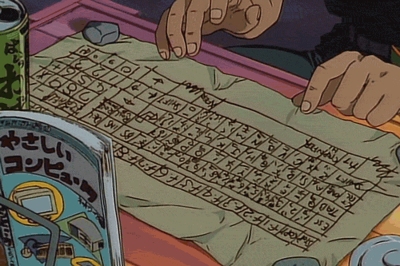
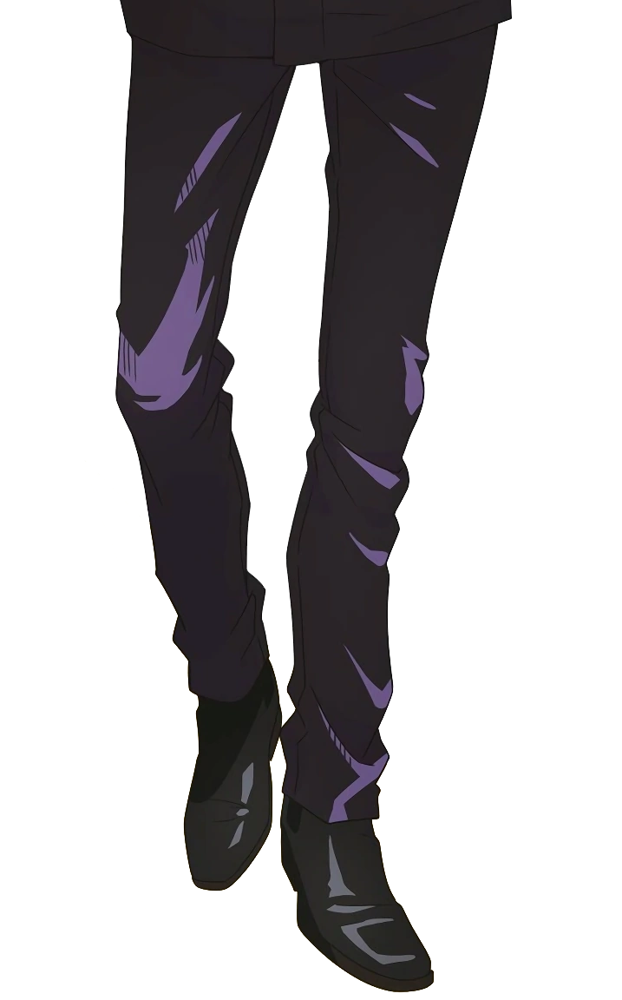

<div align="center">

<a href="https://github.com/leonardoPBF">

</a>
<br>

  [](https://github.com/leonardoPBF)
  [](https://github.com/leonardoPBF)
  

</div>
<div align="center">

## Here’s a little about me 👻

</div>
<div align="center">

[](https://git.io/typing-svg)

</div>

<p>Hi, I'm Leonardo Paul — a university student at USMP with a drive to learn, create, and build. I'm currently on the path to becoming a full stack developer and always open to new opportunities that challenge me and help me grow.</p>

- 🔧 Right now, I’m building a tareos app for a private business .net C#, collaborating on an AI + IT project, and experimenting with Python automation — like auto-responding to Google Forms. Always exploring!. Main tools I’ve been using include:

<div align=center>


</div>

- 🌱 I’m currently learning ...

<div align="center">


</div>

- 😄 Pronouns: leo
- ⚡ Fun fact: i dont know, i'm always crazy
- 📄 Know about my experiences <a href="https://github.com/100rabhcsmc/Me.io/blob/master/01SaurabhChavanReactNativeResume.pdf" target="blank">CV</a>

<div align="center">

### GitHub Stats: before i become better 

<div>

<!--- stats & Trophy (start) -->

  <!--- stats (start) -->
<table align="center">
<tr border="none">
<td width="50%" align="center">
  
<div align=center width=100%>

 

<!-- [](https://git.io/streak-stats)  -->


<!-- [](https://github.com/ryo-ma/github-profile-trophy) -->
</div>

<!--- trophy (start) -->
<div align=center>
  <a href="https://github.com/ryo-ma/github-profile-trophy" title="Go to Source">
      
    </a>
</div>
<!--- trophy (start) -->

</td>

<td width="50%" align="center">

  
  
  </td>
</tr>
</table>
<!--- stats (end) -->

**just a simple boy who reaches be better**

### 🛠 &nbsp;Tech Stack


&nbsp;
&nbsp;
&nbsp;
&nbsp;
&nbsp;
&nbsp;
&nbsp;
&nbsp;
&nbsp;
&nbsp;
&nbsp;
&nbsp;
&nbsp;
&nbsp;


### 🗃 &nbsp;Databases

&nbsp;
&nbsp;


<a href="https://github.com/leonardoPBF">

</a>

### 🧰 &nbsp;Version Controll & Tools 

&nbsp;
&nbsp;
&nbsp;
&nbsp;
&nbsp;
&nbsp;
&nbsp;
&nbsp;

<a href="https://github.com/leonardoPBF">

</a>

<picture>
  <source
    media="(prefers-color-scheme: dark)"
    srcset="https://raw.githubusercontent.com/platane/snk/output/github-contribution-grid-snake-dark.svg"
  />
  <source
    media="(prefers-color-scheme: light)"
    srcset="https://raw.githubusercontent.com/platane/snk/output/github-contribution-grid-snake.svg"
  />
  
</picture>

</p>
<!--- stats (end) -->

<h3 align="center" > Connect with me 🤝 </h3>

<p align="center">

<div align="center"  class="icons-social" style="margin-left: 10px;">
        <a style="margin-left: 10px;"  target="_blank" href="https://www.linkedin.com/in/leonardo-paul-buitron-farfan-159949206/">
			</a>
        <a style="margin-left: 10px;" target="_blank" href="https://github.com/leonardoPBF">
		</a>
</div>

</p>

### Gojo

<div align="center">

  

  <details>
    <summary>Don't open please :v</summary>

  <br>

  [](https://git.io/typing-svg)
        
```js
/**
 * Represents me.
 *
 * @constructor
 * @param {string} location - Peru
 * @param {string} languagues - English, spanish
 * @param {string} jobTitle - Engineer of systems.
 * @param {string} specialization - Building full stack apps
 * @param {string} interests - AI, Distributed Systems & Programing
 * @param {string} hobbies - Trekking, basketball, football, voley, run, gaming & playing music.
 * @param {string} stength - Resolute.
 * @param {string} weakness - control of my time and G.
 *
 * @throws {Punch} To the people who don't want to be better, the team problems and all bugs.
 *
 * @returns {Object} Leo.
 */
```
        </pre>
      </div>
</details>
  </details>

  

</div>
